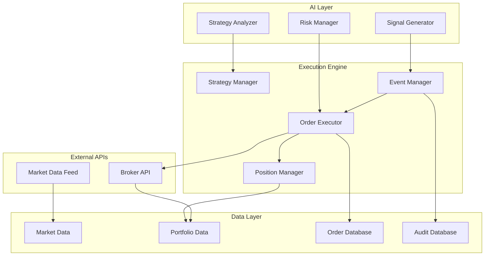

# Automatic Trading Engine - Design Document

## Overview

The Automatic Trading Engine is the core component that transforms QuantumLeap from an AI advisory platform into a fully automated trading system. It bridges the gap between AI-generated signals and live order execution while maintaining robust risk management and user control.

The engine operates as a real-time event-driven system that processes AI signals, validates against risk parameters, executes orders through broker APIs, and continuously monitors performance. It integrates seamlessly with existing AI systems while providing comprehensive user control and audit capabilities.

## Architecture

### High-Level Architecture



### Component Architecture

#### 1. Event-Driven Core
- **Event Bus**: Central message broker for all system events
- **Event Types**: Signal events, order events, risk events, market events
- **Event Processing**: Asynchronous event handling with priority queues
- **Event Persistence**: All events logged for audit and replay

#### 2. Order Execution Pipeline
```
Signal → Risk Validation → Order Creation → Broker Submission → Execution Tracking → Portfolio Update
```

#### 3. Real-Time Processing
- **WebSocket Connections**: Real-time market data and order updates
- **In-Memory Caching**: Fast access to positions, orders, and market data
- **Background Workers**: Asynchronous processing of non-critical tasks
- **Health Monitoring**: Continuous system health checks and alerts

## Components and Interfaces

### 1. Order Execution Engine (`OrderExecutor`)

**Purpose**: Core component responsible for executing trading orders based on AI signals

**Key Methods**:
```python
class OrderExecutor:
    async def process_signal(self, signal: TradingSignal) -> OrderResult
    async def place_order(self, order: Order) -> ExecutionResult
    async def cancel_order(self, order_id: str) -> CancelResult
    async def modify_order(self, order_id: str, modifications: dict) -> ModifyResult
    async def get_order_status(self, order_id: str) -> OrderStatus
```

**Responsibilities**:
- Validate signals against risk parameters
- Create appropriate order types (market, limit, stop-loss)
- Submit orders to broker API with retry logic
- Track order status and handle partial fills
- Update portfolio positions in real-time

### 2. Strategy Manager (`StrategyManager`)

**Purpose**: Manages deployment, monitoring, and lifecycle of trading strategies

**Key Methods**:
```python
class StrategyManager:
    async def deploy_strategy(self, strategy: Strategy, user_id: str) -> DeploymentResult
    async def pause_strategy(self, strategy_id: str) -> PauseResult
    async def resume_strategy(self, strategy_id: str) -> ResumeResult
    async def stop_strategy(self, strategy_id: str) -> StopResult
    async def get_strategy_performance(self, strategy_id: str) -> PerformanceMetrics
```

**Responsibilities**:
- Deploy strategies for live execution
- Monitor strategy performance against benchmarks
- Automatically pause underperforming strategies
- Handle strategy modifications and updates
- Generate performance reports and alerts

### 3. Risk Management Engine (`RiskEngine`)

**Purpose**: Real-time risk monitoring and enforcement across all trading activities

**Key Methods**:
```python
class RiskEngine:
    async def validate_order(self, order: Order, portfolio: Portfolio) -> RiskValidation
    async def check_position_limits(self, symbol: str, quantity: int) -> LimitCheck
    async def monitor_portfolio_risk(self, portfolio: Portfolio) -> RiskAssessment
    async def enforce_stop_loss(self, position: Position) -> StopLossAction
    async def calculate_position_size(self, signal: TradingSignal) -> PositionSize
```

**Responsibilities**:
- Validate all orders against risk parameters
- Monitor portfolio exposure and concentration
- Enforce stop-loss and take-profit levels
- Calculate optimal position sizes
- Generate risk alerts and emergency stops

### 4. Position Manager (`PositionManager`)

**Purpose**: Track and manage all trading positions in real-time

**Key Methods**:
```python
class PositionManager:
    async def update_position(self, execution: Execution) -> PositionUpdate
    async def get_current_positions(self, user_id: str) -> List[Position]
    async def calculate_pnl(self, position: Position) -> PnLCalculation
    async def close_position(self, position_id: str) -> CloseResult
    async def get_position_history(self, symbol: str) -> List[PositionHistory]
```

**Responsibilities**:
- Track all open and closed positions
- Calculate real-time P&L and performance metrics
- Handle position updates from order executions
- Manage position lifecycle and history
- Provide position data for risk calculations

### 5. Event Manager (`EventManager`)

**Purpose**: Central event processing and coordination system

**Key Methods**:
```python
class EventManager:
    async def publish_event(self, event: Event) -> PublishResult
    async def subscribe_to_events(self, event_types: List[str], handler: EventHandler) -> Subscription
    async def process_event_queue(self) -> ProcessingResult
    async def get_event_history(self, filters: EventFilters) -> List[Event]
```

**Responsibilities**:
- Route events between system components
- Maintain event queues and processing order
- Handle event persistence and replay
- Coordinate system-wide state changes
- Provide event-based audit trails

### 6. Market Data Manager (`MarketDataManager`)

**Purpose**: Real-time market data processing and distribution

**Key Methods**:
```python
class MarketDataManager:
    async def subscribe_to_symbol(self, symbol: str) -> Subscription
    async def get_current_price(self, symbol: str) -> Price
    async def get_market_status(self) -> MarketStatus
    async def handle_price_update(self, price_data: PriceData) -> UpdateResult
```

**Responsibilities**:
- Maintain real-time price feeds
- Distribute market data to components
- Handle market status changes
- Provide historical price data
- Manage data feed connections

## Data Models

### Core Trading Models

```python
@dataclass
class TradingSignal:
    id: str
    symbol: str
    signal_type: SignalType  # BUY, SELL, HOLD
    confidence_score: float
    target_price: Optional[float]
    stop_loss: Optional[float]
    position_size: float
    strategy_id: str
    created_at: datetime
    expires_at: datetime
    metadata: Dict[str, Any]

@dataclass
class Order:
    id: str
    user_id: str
    symbol: str
    order_type: OrderType  # MARKET, LIMIT, STOP_LOSS
    side: OrderSide  # BUY, SELL
    quantity: int
    price: Optional[float]
    stop_price: Optional[float]
    status: OrderStatus
    strategy_id: Optional[str]
    signal_id: Optional[str]
    created_at: datetime
    updated_at: datetime

@dataclass
class Position:
    id: str
    user_id: str
    symbol: str
    quantity: int
    average_price: float
    current_price: float
    unrealized_pnl: float
    realized_pnl: float
    strategy_id: Optional[str]
    opened_at: datetime
    updated_at: datetime

@dataclass
class Strategy:
    id: str
    user_id: str
    name: str
    strategy_type: StrategyType
    configuration: Dict[str, Any]
    risk_parameters: RiskParameters
    status: StrategyStatus
    performance_metrics: PerformanceMetrics
    created_at: datetime
    deployed_at: Optional[datetime]
```

### Risk Management Models

```python
@dataclass
class RiskParameters:
    max_position_size: float
    max_portfolio_exposure: float
    max_sector_exposure: float
    stop_loss_percentage: float
    take_profit_percentage: float
    max_drawdown: float
    daily_loss_limit: float

@dataclass
class RiskValidation:
    is_valid: bool
    risk_score: float
    violations: List[RiskViolation]
    recommended_adjustments: Dict[str, Any]
    validation_timestamp: datetime
```

## Error Handling

### Error Categories

1. **Broker API Errors**
   - Connection failures
   - Authentication errors
   - Rate limiting
   - Order rejection

2. **Risk Management Errors**
   - Position limit violations
   - Insufficient funds
   - Risk threshold breaches
   - Emergency stop triggers

3. **System Errors**
   - Database connection failures
   - Market data feed interruptions
   - Internal processing errors
   - Configuration errors

### Error Handling Strategy

```python
class ErrorHandler:
    async def handle_broker_error(self, error: BrokerError, order: Order) -> ErrorResponse:
        if error.is_retryable():
            return await self.retry_with_backoff(order)
        else:
            return await self.log_and_alert(error, order)
    
    async def handle_risk_violation(self, violation: RiskViolation) -> RiskResponse:
        if violation.severity == "CRITICAL":
            return await self.emergency_stop()
        else:
            return await self.adjust_and_continue(violation)
```

### Retry Logic

- **Exponential Backoff**: 1s, 2s, 4s, 8s intervals
- **Maximum Retries**: 3 attempts for order placement
- **Circuit Breaker**: Temporary suspension after repeated failures
- **Fallback Actions**: Alternative execution paths when primary fails

## Testing Strategy

### Unit Testing
- **Component Isolation**: Test each component independently
- **Mock Dependencies**: Mock external APIs and databases
- **Edge Cases**: Test error conditions and boundary cases
- **Performance**: Validate response times and throughput

### Integration Testing
- **End-to-End Flows**: Test complete signal-to-execution pipeline
- **API Integration**: Test broker API interactions
- **Database Operations**: Validate data persistence and retrieval
- **Event Processing**: Test event flow and coordination

### Load Testing
- **Concurrent Users**: Test multiple strategies simultaneously
- **High-Frequency Signals**: Validate performance under signal load
- **Market Data Volume**: Test with high-frequency market updates
- **Database Stress**: Test database performance under load

### Risk Testing
- **Risk Scenario Simulation**: Test various risk conditions
- **Emergency Procedures**: Validate emergency stop functionality
- **Compliance Validation**: Ensure regulatory compliance
- **Audit Trail Verification**: Validate complete audit capabilities

### Backtesting Integration
- **Historical Replay**: Test strategies against historical data
- **Performance Validation**: Compare live vs backtested results
- **Risk Metric Validation**: Verify risk calculations
- **Strategy Optimization**: Test strategy parameter adjustments

## Security Considerations

### Authentication and Authorization
- **Multi-Factor Authentication**: Required for strategy deployment
- **Role-Based Access**: Different permissions for different user types
- **API Key Management**: Secure storage and rotation of broker API keys
- **Session Management**: Secure session handling with timeout

### Data Protection
- **Encryption at Rest**: All sensitive data encrypted in database
- **Encryption in Transit**: TLS for all API communications
- **PII Protection**: Personal information properly anonymized
- **Audit Logging**: Comprehensive logging without sensitive data exposure

### System Security
- **Input Validation**: All inputs validated and sanitized
- **SQL Injection Prevention**: Parameterized queries only
- **Rate Limiting**: Prevent abuse of API endpoints
- **Monitoring**: Real-time security monitoring and alerting

## Performance Requirements

### Response Times
- **Signal Processing**: < 500ms from signal to order placement
- **Order Execution**: < 1s for order submission to broker
- **Risk Validation**: < 100ms for risk checks
- **Position Updates**: < 200ms for position calculations

### Throughput
- **Concurrent Strategies**: Support 100+ active strategies per user
- **Order Volume**: Handle 1000+ orders per minute system-wide
- **Market Data**: Process 10,000+ price updates per second
- **Event Processing**: Handle 50,000+ events per minute

### Scalability
- **Horizontal Scaling**: Support multiple application instances
- **Database Scaling**: Read replicas for query performance
- **Caching Strategy**: Redis for high-frequency data access
- **Load Balancing**: Distribute load across instances

## Monitoring and Observability

### Key Metrics
- **Order Success Rate**: Percentage of successful order executions
- **Signal-to-Execution Latency**: Time from signal to order placement
- **Strategy Performance**: Real-time strategy P&L and metrics
- **System Health**: CPU, memory, database performance
- **Error Rates**: Categorized error frequency and trends

### Alerting
- **Critical Alerts**: System failures, emergency stops, risk breaches
- **Warning Alerts**: Performance degradation, unusual patterns
- **Info Alerts**: Strategy deployments, configuration changes
- **User Notifications**: Trade executions, performance updates

### Dashboards
- **Operations Dashboard**: System health and performance metrics
- **Trading Dashboard**: Real-time trading activity and performance
- **Risk Dashboard**: Portfolio risk metrics and violations
- **User Dashboard**: Individual user trading activity and results

## Deployment Strategy

### Environment Setup
- **Development**: Local development with mock broker APIs
- **Staging**: Full integration testing with paper trading
- **Production**: Live trading with real broker connections
- **Disaster Recovery**: Backup systems and failover procedures

### Rollout Plan
1. **Phase 1**: Deploy to limited beta users with manual oversight
2. **Phase 2**: Gradual rollout to more users with monitoring
3. **Phase 3**: Full production deployment with all features
4. **Phase 4**: Performance optimization and feature enhancements

### Monitoring During Deployment
- **Real-time Metrics**: Monitor all key performance indicators
- **Error Tracking**: Immediate alerting on any errors
- **User Feedback**: Collect and respond to user issues
- **Rollback Plan**: Ability to quickly revert if issues arise