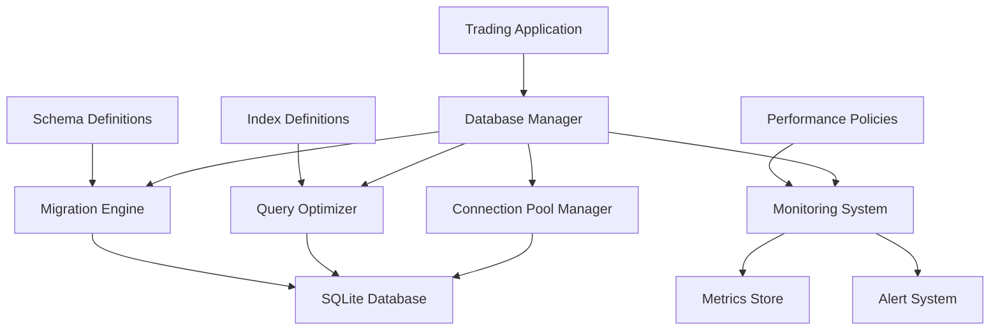

# Database Optimization and Migration Design

## Overview

This design document outlines a comprehensive database optimization system for the QuantumLeap trading platform. The system will transform the current SQLite database (`sqlite:///production_trading.db`) into a high-performance, scalable data layer capable of handling high-frequency trading operations with sub-50ms query response times.

The design focuses on four core areas: performance optimization through intelligent indexing and query optimization, data integrity through ACID-compliant transactions, automated schema migrations with rollback capabilities, and comprehensive monitoring with proactive alerting.

## Architecture

### High-Level Architecture



### Component Architecture

The system consists of six main components:

1. **Database Manager**: Central coordinator for all database operations
2. **Connection Pool Manager**: Handles connection lifecycle and pooling
3. **Query Optimizer**: Analyzes and optimizes database queries
4. **Migration Engine**: Manages schema changes and versioning
5. **Monitoring System**: Tracks performance and health metrics
6. **Data Lifecycle Manager**: Handles archival and cleanup operations

## Components and Interfaces

### Database Manager

**Purpose**: Central hub for all database operations with built-in optimization and monitoring.

**Key Methods**:
- `execute_query(query, params, timeout=50)`: Execute optimized queries with performance tracking
- `execute_transaction(operations)`: Execute atomic transactions with rollback capability
- `get_connection()`: Retrieve optimized database connection from pool
- `health_check()`: Comprehensive database health assessment

**Performance Features**:
- Automatic query plan caching
- Connection pooling with intelligent load balancing
- Query timeout enforcement
- Automatic retry with exponential backoff

### Connection Pool Manager

**Purpose**: Optimize database connection usage for concurrent operations.

**Configuration**:
```python
POOL_CONFIG = {
    'min_connections': 5,
    'max_connections': 100,
    'connection_timeout': 30,
    'idle_timeout': 300,
    'retry_attempts': 3
}
```

**Key Features**:
- Dynamic pool sizing based on load
- Connection health monitoring
- Automatic connection recycling
- Circuit breaker for failed connections

### Query Optimizer

**Purpose**: Analyze and optimize database queries for maximum performance.

**Optimization Strategies**:
1. **Index Analysis**: Automatically suggest and create optimal indexes
2. **Query Rewriting**: Transform inefficient queries into optimized versions
3. **Execution Plan Caching**: Cache and reuse optimal execution plans
4. **Statistics Management**: Keep database statistics current for optimal planning

**Index Strategy**:
```sql
-- Trading-specific indexes for optimal performance
CREATE INDEX idx_trades_symbol_timestamp ON trades(symbol, timestamp);
CREATE INDEX idx_portfolio_user_symbol ON portfolio(user_id, symbol);
CREATE INDEX idx_orders_status_timestamp ON orders(status, created_at);
CREATE INDEX idx_signals_confidence_timestamp ON signals(confidence_score, timestamp);
```

### Migration Engine

**Purpose**: Handle database schema changes with zero-downtime deployments.

**Migration Workflow**:
1. **Version Check**: Verify current schema version
2. **Backup Creation**: Create automatic backup before migration
3. **Migration Execution**: Apply changes in atomic transactions
4. **Validation**: Verify migration success
5. **Rollback Capability**: Automatic rollback on failure

**Migration File Structure**:
```
migrations/
├── 001_initial_schema.sql
├── 002_add_trading_indexes.sql
├── 003_optimize_portfolio_table.sql
└── rollback/
    ├── 002_rollback.sql
    └── 003_rollback.sql
```

### Monitoring System

**Purpose**: Comprehensive database performance monitoring and alerting.

**Metrics Collected**:
- Query execution times (p50, p95, p99)
- Connection pool utilization
- Database size and growth rate
- Index usage statistics
- Lock contention metrics
- Error rates and types

**Alert Thresholds**:
```python
ALERT_THRESHOLDS = {
    'query_time_p95': 100,  # ms
    'connection_pool_usage': 80,  # %
    'database_size': 5000,  # MB
    'error_rate': 1,  # %
    'lock_wait_time': 1000  # ms
}
```

## Data Models

### Enhanced Database Schema

**Core Trading Tables**:
```sql
-- Optimized trades table with partitioning support
CREATE TABLE trades (
    id INTEGER PRIMARY KEY AUTOINCREMENT,
    user_id TEXT NOT NULL,
    symbol TEXT NOT NULL,
    quantity REAL NOT NULL,
    price REAL NOT NULL,
    side TEXT NOT NULL,
    timestamp DATETIME DEFAULT CURRENT_TIMESTAMP,
    strategy_id TEXT,
    execution_time_ms INTEGER,
    FOREIGN KEY (user_id) REFERENCES users(id)
);

-- Portfolio table with optimized structure
CREATE TABLE portfolio (
    id INTEGER PRIMARY KEY AUTOINCREMENT,
    user_id TEXT NOT NULL,
    symbol TEXT NOT NULL,
    quantity REAL NOT NULL,
    average_cost REAL NOT NULL,
    last_updated DATETIME DEFAULT CURRENT_TIMESTAMP,
    UNIQUE(user_id, symbol),
    FOREIGN KEY (user_id) REFERENCES users(id)
);

-- Performance metrics table
CREATE TABLE performance_metrics (
    id INTEGER PRIMARY KEY AUTOINCREMENT,
    metric_name TEXT NOT NULL,
    metric_value REAL NOT NULL,
    timestamp DATETIME DEFAULT CURRENT_TIMESTAMP,
    metadata TEXT  -- JSON for additional context
);
```

**Database Metadata Tables**:
```sql
-- Schema version tracking
CREATE TABLE schema_versions (
    version INTEGER PRIMARY KEY,
    applied_at DATETIME DEFAULT CURRENT_TIMESTAMP,
    description TEXT,
    rollback_script TEXT
);

-- Query performance tracking
CREATE TABLE query_performance (
    id INTEGER PRIMARY KEY AUTOINCREMENT,
    query_hash TEXT NOT NULL,
    execution_time_ms INTEGER NOT NULL,
    timestamp DATETIME DEFAULT CURRENT_TIMESTAMP,
    query_plan TEXT
);
```

## Error Handling

### Database Error Categories

1. **Connection Errors**: Network issues, connection pool exhaustion
2. **Query Errors**: Syntax errors, constraint violations
3. **Performance Errors**: Timeout, slow query detection
4. **Migration Errors**: Schema conflicts, data corruption
5. **Integrity Errors**: Foreign key violations, data inconsistency

### Error Recovery Strategies

**Automatic Retry Logic**:
```python
@retry(
    stop=stop_after_attempt(3),
    wait=wait_exponential(multiplier=1, min=4, max=10),
    retry=retry_if_exception_type((sqlite3.OperationalError, sqlite3.DatabaseError))
)
def execute_with_retry(query, params):
    # Implementation with automatic retry
    pass
```

**Circuit Breaker Pattern**:
- Open circuit after 5 consecutive failures
- Half-open state after 30-second cooldown
- Close circuit after 3 successful operations

## Testing Strategy

### Performance Testing

1. **Load Testing**: Simulate 1000 concurrent database operations
2. **Stress Testing**: Test database limits with extreme load
3. **Endurance Testing**: 24-hour continuous operation test
4. **Scalability Testing**: Test performance with growing data volumes

### Data Integrity Testing

1. **Transaction Testing**: Verify ACID compliance under concurrent load
2. **Corruption Testing**: Test recovery from simulated data corruption
3. **Migration Testing**: Verify schema changes don't lose data
4. **Backup/Restore Testing**: Validate backup integrity and restore procedures

### Monitoring Testing

1. **Alert Testing**: Verify alerts trigger at correct thresholds
2. **Metrics Accuracy**: Validate collected metrics against known values
3. **Dashboard Testing**: Ensure monitoring dashboards display correctly
4. **Performance Impact**: Verify monitoring doesn't impact database performance

### Migration Testing

1. **Forward Migration**: Test all schema upgrades
2. **Rollback Testing**: Verify rollback procedures work correctly
3. **Data Preservation**: Ensure migrations don't lose existing data
4. **Version Conflict**: Test handling of version conflicts

## Implementation Phases

### Phase 1: Core Infrastructure (Week 1-2)
- Database Manager implementation
- Connection Pool Manager
- Basic monitoring setup
- Initial performance optimizations

### Phase 2: Query Optimization (Week 3-4)
- Query Optimizer implementation
- Index analysis and creation
- Query plan caching
- Performance metrics collection

### Phase 3: Migration System (Week 5-6)
- Migration Engine development
- Schema versioning system
- Rollback mechanisms
- Migration testing framework

### Phase 4: Advanced Features (Week 7-8)
- Data lifecycle management
- Advanced monitoring and alerting
- Performance tuning
- Documentation and training

## Performance Targets

- **Query Response Time**: 95% of queries complete within 50ms
- **Concurrent Connections**: Support 100+ concurrent database connections
- **Throughput**: Handle 10,000+ database operations per minute
- **Availability**: 99.9% uptime with automatic failover
- **Data Integrity**: Zero data loss with ACID compliance
- **Migration Time**: Schema migrations complete within 5 minutes