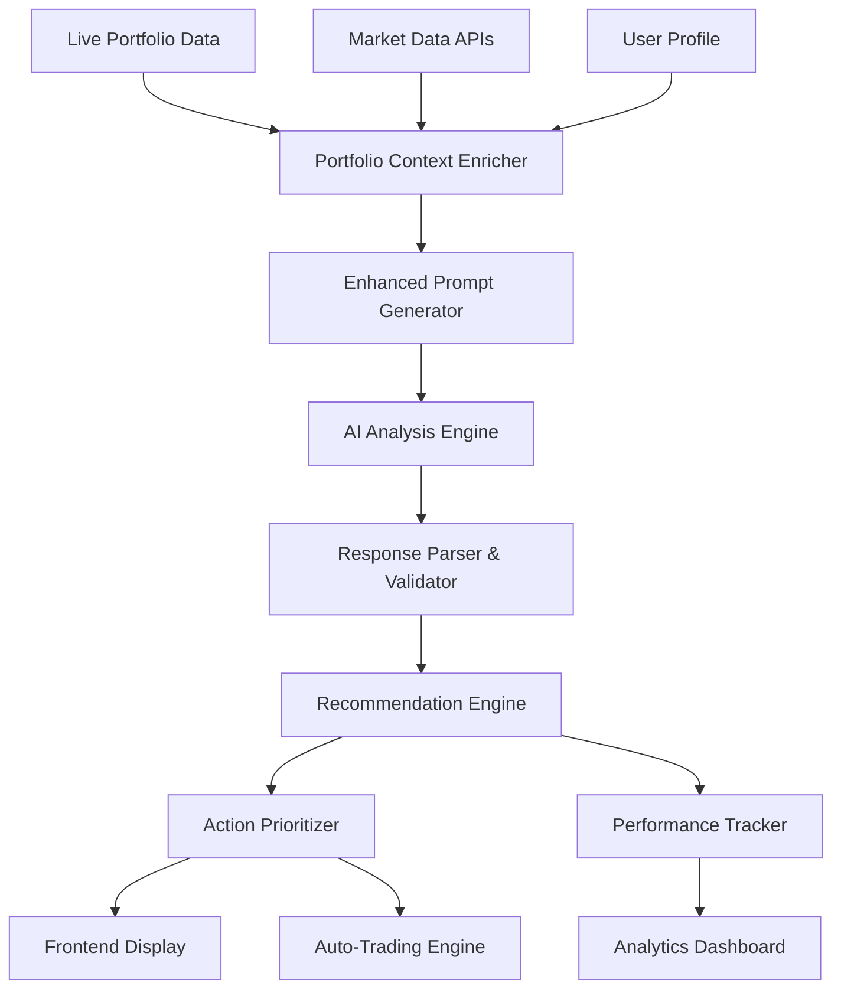

# Enhanced AI Portfolio Analysis - Design Document

## Overview

This design document outlines the transformation of the current generic AI portfolio analysis into a sophisticated system that provides specific, actionable recommendations with clear stock names, precise actions, and detailed reasoning. The enhanced system will integrate with the existing auto-trading engine to enable automated execution of recommendations.

## Current System Analysis

After examining the existing codebase, the following components are already in place and will be enhanced rather than replaced:

### Existing Backend Infrastructure
- **AI Analysis Router** (`app/ai_engine/analysis_router.py`): Comprehensive analysis system with fallback support
- **Simple Analysis Router** (`app/ai_engine/simple_analysis_router.py`): Direct AI integration for immediate analysis
- **Portfolio Service** (`app/portfolio/service.py`): Live portfolio data fetching from Kite Connect with proper P&L calculations
- **Auto-Trading Engine** (`app/trading_engine/`): Complete trading infrastructure with order execution, risk management, and strategy deployment
- **AI Service** (`app/ai_engine/service.py`): Multi-provider AI support (OpenAI, Claude, Gemini, Grok)

### Existing Frontend Components
- **PortfolioAIAnalysis.jsx**: Comprehensive AI analysis interface with health, risk, recommendations, and insights tabs
- **AI Service Integration**: Proper API integration with fallback handling
- **Real-time Updates**: Live portfolio synchronization and analysis refresh

### Current Limitations Identified
1. **Generic Prompts**: Current AI prompts produce vague recommendations without specific stock symbols or quantities
2. **Limited Market Context**: Analysis lacks real-time market data integration and sector-specific insights
3. **No Auto-Trading Integration**: Recommendations cannot be directly executed through the existing trading engine
4. **Missing Performance Tracking**: No system to track recommendation accuracy and outcomes
5. **Insufficient User Personalization**: Analysis doesn't consider user risk profile and investment preferences

## Design Rationale

Rather than rebuilding from scratch, this design enhances the existing robust infrastructure by:
1. **Upgrading AI Prompts**: Transform generic prompts into context-rich, specific instructions
2. **Adding Market Intelligence**: Integrate real-time market data and sector analysis
3. **Enabling Auto-Trading**: Connect recommendations to the existing trading engine
4. **Implementing Performance Tracking**: Add recommendation outcome monitoring
5. **Personalizing Analysis**: Integrate user profiles and preferences
## Enhanced System Architecture

### 1. Enhanced Prompt Engineering System

**Purpose**: Transform the existing generic prompts in `simple_analysis_router.py` into context-rich, specific instructions that generate actionable recommendations

**Implementation Strategy**: 
- Enhance the existing `generate_ai_portfolio_analysis()` function
- Upgrade the current basic prompt to include specific portfolio context
- Maintain compatibility with existing AI providers (OpenAI, Claude, Gemini)

**Enhanced Prompt Structure** (to replace current basic prompt):
```python
def create_enhanced_portfolio_prompt(portfolio_data: Dict[str, Any], user_preferences: Dict[str, Any] = None) -> str:
    """Create enhanced, specific portfolio analysis prompt"""
    
    total_value = portfolio_data.get("total_value", 0)
    holdings = portfolio_data.get("holdings", [])
    positions = portfolio_data.get("positions", [])
    
    # Build portfolio context
    portfolio_context = f"""
PORTFOLIO ANALYSIS - SPECIFIC RECOMMENDATIONS REQUIRED

CURRENT PORTFOLIO:
- Total Value: ₹{total_value:,.2f}
- Holdings Count: {len(holdings)}
- Positions Count: {len(positions)}

HOLDINGS BREAKDOWN:
"""
    
    # Add specific holdings with current allocations
    for holding in holdings[:10]:  # Top 10 holdings
        symbol = holding.get('tradingsymbol', holding.get('symbol', 'Unknown'))
        current_value = holding.get('current_value', 0)
        allocation = (current_value / total_value * 100) if total_value > 0 else 0
        pnl = holding.get('pnl', 0)
        pnl_pct = holding.get('pnl_percentage', 0)
        
        portfolio_context += f"- {symbol}: ₹{current_value:,.0f} ({allocation:.1f}%) | P&L: ₹{pnl:,.0f} ({pnl_pct:.1f}%)\n"
    
    # Add positions if any
    if positions:
        portfolio_context += "\nACTIVE POSITIONS:\n"
        for position in positions[:5]:  # Top 5 positions
            symbol = position.get('tradingsymbol', position.get('symbol', 'Unknown'))
            quantity = position.get('net_quantity', position.get('quantity', 0))
            current_value = position.get('current_value', 0)
            unrealised = position.get('unrealised', position.get('pnl', 0))
            
            portfolio_context += f"- {symbol}: {quantity} shares | Value: ₹{current_value:,.0f} | Unrealized: ₹{unrealised:,.0f}\n"
    
    # Enhanced analysis requirements
    analysis_requirements = """
ANALYSIS REQUIREMENTS - MUST BE SPECIFIC:

1. STOCK-LEVEL RECOMMENDATIONS:
   For each major holding (>5% allocation), provide:
   - Current allocation percentage
   - Recommended target allocation
   - Specific action: BUY/SELL/HOLD/REDUCE/INCREASE
   - Exact quantity to buy/sell (if applicable)
   - Rupee amount involved
   - Clear reasoning based on current market conditions

2. PORTFOLIO REBALANCING:
   - Identify overweight positions (>15% allocation)
   - Suggest specific rebalancing actions
   - Recommend new stocks to add with target allocations
   - Sector diversification improvements

3. RISK ASSESSMENT:
   - Concentration risk analysis with specific thresholds
   - Correlation risks between holdings
   - Volatility concerns with mitigation strategies

4. ACTION PRIORITIES:
   - Immediate actions (1-7 days) with HIGH priority
   - Short-term actions (1-4 weeks) with MEDIUM priority
   - Long-term strategic moves (1-3 months) with LOW priority

OUTPUT FORMAT REQUIREMENTS:
- Use exact NSE trading symbols (RELIANCE, TCS, HDFCBANK, etc.)
- Include specific percentages and rupee amounts
- Provide confidence scores (0-100%) for each recommendation
- Reference current market conditions in reasoning
- Avoid generic advice - be specific about quantities and actions
- Structure as JSON for easy parsing

Provide analysis in this JSON structure:
{
  "portfolio_health": {
    "overall_score": <0-100>,
    "risk_level": "<LOW/MEDIUM/HIGH>",
    "diversification_score": <0-1>,
    "concentration_risk": <0-1>
  },
  "stock_recommendations": [
    {
      "symbol": "<NSE_SYMBOL>",
      "current_allocation": <percentage>,
      "target_allocation": <percentage>,
      "action": "<BUY/SELL/HOLD/REDUCE/INCREASE>",
      "quantity_change": <shares>,
      "value_change": <rupees>,
      "reasoning": "<specific market-based reason>",
      "confidence": <0-100>,
      "priority": "<HIGH/MEDIUM/LOW>",
      "timeframe": "<IMMEDIATE/SHORT_TERM/LONG_TERM>"
    }
  ],
  "sector_analysis": {
    "current_sectors": [{"sector": "<name>", "allocation": <percentage>}],
    "recommendations": [{"sector": "<name>", "target_allocation": <percentage>, "action": "<increase/decrease>"}]
  },
  "risk_analysis": {
    "concentration_risks": [{"symbol": "<symbol>", "allocation": <percentage>, "risk_level": "<HIGH/MEDIUM/LOW>"}],
    "diversification_score": <0-1>,
    "recommended_actions": ["<specific risk mitigation actions>"]
  },
  "key_insights": [
    "<specific actionable insight 1>",
    "<specific actionable insight 2>",
    "<specific actionable insight 3>"
  ]
}
"""
    
    return portfolio_context + analysis_requirements
```

**Integration Points**:
- Enhance `call_openai_analysis()`, `call_claude_analysis()`, `call_gemini_analysis()` functions
- Add response validation to ensure specific recommendations
- Maintain fallback compatibility with existing system

### 2. Advanced Portfolio Intelligence Engine

**Purpose**: Provide deep analysis capabilities with real-time market integration

**Components**:
- **Real-time Data Processor**: Live portfolio values, P&L, market prices
- **Sector Classification Engine**: Automatic sector mapping for Indian stocks
- **Risk Metrics Calculator**: Concentration, correlation, volatility analysis
- **Performance Predictor**: Expected outcomes based on recommendations
- **Market Timing Optimizer**: Optimal execution timing based on market conditions

**Key Features**:
- Live portfolio synchronization with Kite Connect
- Sector-wise risk analysis with Indian market context
- Correlation analysis between holdings
- Expected return calculations for recommendations
- Market timing suggestions based on volatility and volume

### 3. Actionable Recommendation Engine

**Purpose**: Generate specific, implementable recommendations with clear next steps

**Components**:
- **Stock-Specific Analyzer**: Individual stock analysis with exact actions
- **Quantity Calculator**: Precise share quantities and rupee amounts
- **Action Prioritizer**: Risk-based priority assignment
- **Impact Simulator**: Expected portfolio impact of each recommendation
- **Auto-Trading Integrator**: Direct integration with trading engine for execution

**Recommendation Structure**:
```json
{
  "stock_symbol": "RELIANCE",
  "current_allocation": 25.5,
  "target_allocation": 15.0,
  "action": "REDUCE",
  "quantity_change": -50,
  "value_change": -125000,
  "current_price": 2500,
  "reasoning": "Overweight position exceeds 15% concentration limit. Reduce to improve diversification.",
  "confidence_score": 0.85,
  "priority": "HIGH",
  "expected_impact": "Reduce concentration risk by 40%",
  "risk_warning": "Large position reduction may impact returns if stock outperforms",
  "optimal_timing": "Execute over 2-3 days to minimize market impact",
  "auto_trading_eligible": true
}
```

### 4. Enhanced Analytics Dashboard

**Purpose**: Comprehensive analytics interface with deep insights and interactive features

**Components**:
- **Deep Analysis View**: Stock-by-stock detailed breakdown
- **Scenario Simulator**: What-if analysis for portfolio changes
- **Performance Tracker**: Historical recommendation accuracy
- **Interactive Charts**: Sector allocation, risk metrics, performance trends
- **Export Engine**: PDF reports, CSV data, action checklists

**New Analytics Features**:
- Stock correlation heatmap
- Sector allocation vs benchmark comparison
- Risk-return scatter plots
- Historical recommendation performance tracking
- Portfolio optimization scenarios

### 5. Auto-Trading Integration Layer

**Purpose**: Seamless integration with the existing auto-trading engine for automated execution

**Components**:
- **Recommendation Translator**: Converts AI recommendations to trading orders
- **Risk Validator**: Validates recommendations against trading rules
- **Execution Scheduler**: Optimal timing for order execution
- **Progress Tracker**: Real-time tracking of recommendation implementation
- **Performance Monitor**: Tracks actual vs predicted outcomes

**Integration Features**:
- One-click recommendation implementation
- Batch order execution with smart timing
- Real-time progress tracking
- Automatic stop-loss and target setting
- Performance attribution analysis

## Data Flow Architecture



## Database Schema Enhancements

### Enhanced Recommendations Table
```sql
CREATE TABLE enhanced_recommendations (
    id INTEGER PRIMARY KEY AUTOINCREMENT,
    user_id TEXT NOT NULL,
    analysis_id TEXT NOT NULL,
    stock_symbol TEXT NOT NULL,
    current_allocation DECIMAL(5,2),
    target_allocation DECIMAL(5,2),
    action_type TEXT NOT NULL, -- BUY, SELL, HOLD, REDUCE, INCREASE
    quantity_change INTEGER,
    value_change DECIMAL(15,2),
    current_price DECIMAL(10,2),
    reasoning TEXT NOT NULL,
    confidence_score DECIMAL(3,2),
    priority_level TEXT NOT NULL, -- HIGH, MEDIUM, LOW
    timeframe TEXT NOT NULL, -- IMMEDIATE, SHORT_TERM, LONG_TERM
    expected_impact TEXT,
    risk_warning TEXT,
    optimal_timing TEXT,
    auto_trading_eligible BOOLEAN DEFAULT FALSE,
    market_context TEXT,
    sector TEXT,
    created_at TIMESTAMP DEFAULT CURRENT_TIMESTAMP,
    updated_at TIMESTAMP DEFAULT CURRENT_TIMESTAMP
);
```

### Performance Tracking Table
```sql
CREATE TABLE recommendation_performance (
    id INTEGER PRIMARY KEY AUTOINCREMENT,
    recommendation_id INTEGER REFERENCES enhanced_recommendations(id),
    implemented_date TIMESTAMP,
    implementation_method TEXT, -- MANUAL, AUTO_TRADING
    actual_price DECIMAL(10,2),
    predicted_price DECIMAL(10,2),
    actual_outcome DECIMAL(10,2),
    predicted_outcome DECIMAL(10,2),
    accuracy_score DECIMAL(3,2),
    user_feedback INTEGER, -- 1-5 rating
    user_feedback_text TEXT,
    market_conditions TEXT,
    created_at TIMESTAMP DEFAULT CURRENT_TIMESTAMP
);
```

### User Investment Profile Table
```sql
CREATE TABLE user_investment_profiles (
    id INTEGER PRIMARY KEY AUTOINCREMENT,
    user_id TEXT NOT NULL UNIQUE,
    risk_tolerance TEXT NOT NULL, -- conservative, moderate, aggressive
    investment_timeline TEXT NOT NULL, -- short_term, medium_term, long_term
    preferred_sectors JSON,
    max_position_size DECIMAL(5,2) DEFAULT 15.0,
    trading_frequency TEXT DEFAULT 'monthly',
    auto_trading_enabled BOOLEAN DEFAULT FALSE,
    stop_loss_preference DECIMAL(5,2) DEFAULT 10.0,
    take_profit_preference DECIMAL(5,2) DEFAULT 25.0,
    created_at TIMESTAMP DEFAULT CURRENT_TIMESTAMP,
    updated_at TIMESTAMP DEFAULT CURRENT_TIMESTAMP
);
```

### Market Context Table
```sql
CREATE TABLE market_context (
    id INTEGER PRIMARY KEY AUTOINCREMENT,
    date DATE NOT NULL,
    nifty_trend TEXT,
    nifty_movement DECIMAL(5,2),
    sector_performance JSON,
    market_sentiment TEXT,
    volatility_index DECIMAL(5,2),
    key_events JSON,
    created_at TIMESTAMP DEFAULT CURRENT_TIMESTAMP
);
```

## API Enhancements

### Enhanced Analysis Endpoint
```python
@router.post("/enhanced-analysis/portfolio")
async def enhanced_portfolio_analysis(
    portfolio_data: Dict[str, Any],
    user_id: str = Depends(get_user_id_from_headers)
):
    """Generate enhanced, specific portfolio analysis with actionable recommendations"""
    try:
        # 1. Enrich portfolio data with market context
        enriched_data = await enrich_portfolio_context(portfolio_data, user_id)
        
        # 2. Generate enhanced AI prompt
        enhanced_prompt = await create_enhanced_prompt(enriched_data, user_id)
        
        # 3. Get AI analysis with enhanced prompt
        ai_response = await get_ai_analysis(enhanced_prompt, user_id)
        
        # 4. Parse and validate response
        structured_recommendations = await parse_and_validate_response(ai_response)
        
        # 5. Generate action items
        action_items = await generate_action_items(structured_recommendations)
        
        # 6. Store recommendations for tracking
        await store_enhanced_recommendations(user_id, structured_recommendations)
        
        # 7. Calculate portfolio metrics
        portfolio_metrics = await calculate_enhanced_metrics(portfolio_data, structured_recommendations)
        
        return {
            "status": "success",
            "analysis_id": f"enhanced_{user_id}_{int(datetime.now().timestamp())}",
            "timestamp": datetime.now().isoformat(),
            "analysis": {
                "portfolio_health": portfolio_metrics["health"],
                "risk_analysis": portfolio_metrics["risk"],
                "stock_recommendations": structured_recommendations,
                "action_items": action_items,
                "sector_analysis": portfolio_metrics["sectors"],
                "performance_prediction": portfolio_metrics["predictions"]
            },
            "market_context": enriched_data["market_context"],
            "auto_trading_eligible": len([r for r in structured_recommendations if r.get("auto_trading_eligible")]),
            "confidence_score": calculate_overall_confidence(structured_recommendations)
        }
        
    except Exception as e:
        logger.error(f"Enhanced portfolio analysis failed: {e}")
        # Fallback to current system
        return await simple_portfolio_analysis(portfolio_data, user_id)
```

### Auto-Trading Integration Endpoint
```python
@router.post("/enhanced-analysis/execute-recommendations")
async def execute_recommendations(
    recommendation_ids: List[str],
    execution_mode: str = "IMMEDIATE",  # IMMEDIATE, SCHEDULED, GRADUAL
    user_id: str = Depends(get_user_id_from_headers)
):
    """Execute AI recommendations through auto-trading engine"""
    try:
        # 1. Validate recommendations
        recommendations = await get_recommendations_by_ids(recommendation_ids, user_id)
        
        # 2. Convert to trading orders
        trading_orders = await convert_recommendations_to_orders(recommendations)
        
        # 3. Validate with risk engine
        validated_orders = await validate_orders_with_risk_engine(trading_orders, user_id)
        
        # 4. Submit to auto-trading engine
        execution_results = await submit_to_trading_engine(validated_orders, execution_mode)
        
        # 5. Track execution
        await track_recommendation_execution(recommendation_ids, execution_results)
        
        return {
            "status": "success",
            "execution_id": f"exec_{user_id}_{int(datetime.now().timestamp())}",
            "orders_submitted": len(validated_orders),
            "estimated_execution_time": calculate_execution_time(execution_mode),
            "execution_results": execution_results
        }
        
    except Exception as e:
        logger.error(f"Recommendation execution failed: {e}")
        raise HTTPException(status_code=500, detail=str(e))
```

### Performance Tracking Endpoint
```python
@router.get("/enhanced-analysis/performance/{user_id}")
async def get_recommendation_performance(
    user_id: str,
    days: int = 30,
    recommendation_type: Optional[str] = None
):
    """Get performance tracking for AI recommendations"""
    try:
        performance_data = await get_recommendation_performance_data(
            user_id, days, recommendation_type
        )
        
        return {
            "status": "success",
            "performance_summary": {
                "total_recommendations": performance_data["total_count"],
                "implemented_recommendations": performance_data["implemented_count"],
                "successful_predictions": performance_data["successful_count"],
                "accuracy_rate": performance_data["accuracy_rate"],
                "average_return": performance_data["average_return"],
                "best_recommendation": performance_data["best_performer"],
                "worst_recommendation": performance_data["worst_performer"]
            },
            "detailed_performance": performance_data["detailed_results"],
            "time_period_days": days
        }
        
    except Exception as e:
        logger.error(f"Performance tracking failed: {e}")
        raise HTTPException(status_code=500, detail=str(e))
```

## Frontend Enhancements

### Enhanced Portfolio Analysis Component
Building on the existing `PortfolioAIAnalysis.jsx`, we will add new features while maintaining the current tabbed interface:

```jsx
const EnhancedPortfolioAnalysis = ({ portfolioData, onRefresh }) => {
  const [analysis, setAnalysis] = useState(null);
  const [selectedRecommendations, setSelectedRecommendations] = useState([]);
  const [executionMode, setExecutionMode] = useState('IMMEDIATE');

  const handleExecuteRecommendations = async () => {
    try {
      const result = await aiService.executeRecommendations(
        selectedRecommendations,
        executionMode
      );
      
      toast({
        title: "Recommendations Executed",
        description: `${result.orders_submitted} orders submitted to auto-trading engine`,
      });
      
      // Refresh analysis after execution
      await handleAnalyze();
    } catch (error) {
      toast({
        title: "Execution Failed",
        description: error.message,
        variant: "destructive",
      });
    }
  };

  return (
    <div className="enhanced-analysis-container">
      {/* Analysis Header with Auto-Trading Integration */}
      <AnalysisHeader 
        analysis={analysis}
        onRefresh={handleAnalyze}
        autoTradingEligible={analysis?.auto_trading_eligible || 0}
      />
      
      {/* Enhanced Tabs - Add new "Actions" tab */}
      <Tabs value={activeTab} onValueChange={setActiveTab}>
        <TabsList className="grid w-full grid-cols-5">
          <TabsTrigger value="health">Health</TabsTrigger>
          <TabsTrigger value="risk">Risk</TabsTrigger>
          <TabsTrigger value="recommendations">Recommendations</TabsTrigger>
          <TabsTrigger value="actions">Actions</TabsTrigger>
          <TabsTrigger value="insights">Insights</TabsTrigger>
        </TabsList>

        {/* Existing tabs enhanced with specific data */}
        <TabsContent value="recommendations">
          <StockRecommendationsGrid 
            recommendations={analysis?.stock_recommendations || []}
            onSelectionChange={setSelectedRecommendations}
            selectedRecommendations={selectedRecommendations}
          />
        </TabsContent>

        {/* New Actions tab for auto-trading integration */}
        <TabsContent value="actions">
          <ActionCenter 
            actionItems={analysis?.action_items || []}
            selectedRecommendations={selectedRecommendations}
            executionMode={executionMode}
            onExecutionModeChange={setExecutionMode}
            onExecute={handleExecuteRecommendations}
          />
        </TabsContent>
      </Tabs>
    </div>
  );
};
```

### New Components for Enhanced Features

#### Stock Recommendations Grid
```jsx
const StockRecommendationsGrid = ({ recommendations, onSelectionChange, selectedRecommendations }) => {
  return (
    <div className="space-y-4">
      {recommendations.map((rec, index) => (
        <Card key={index} className="p-4">
          <div className="flex items-center justify-between">
            <div className="flex items-center space-x-4">
              <Checkbox 
                checked={selectedRecommendations.includes(rec.id)}
                onCheckedChange={(checked) => {
                  if (checked) {
                    onSelectionChange([...selectedRecommendations, rec.id]);
                  } else {
                    onSelectionChange(selectedRecommendations.filter(id => id !== rec.id));
                  }
                }}
              />
              <div>
                <h3 className="font-semibold text-lg">{rec.symbol}</h3>
                <p className="text-sm text-gray-600">{rec.reasoning}</p>
              </div>
            </div>
            <div className="text-right">
              <Badge className={getActionColor(rec.action)}>{rec.action}</Badge>
              <div className="text-sm mt-1">
                <span className="font-medium">Target: {rec.target_allocation}%</span>
                <br />
                <span>Confidence: {rec.confidence}%</span>
              </div>
            </div>
          </div>
          
          {/* Detailed recommendation info */}
          <div className="mt-4 grid grid-cols-3 gap-4 text-sm">
            <div>
              <span className="text-gray-500">Current Allocation:</span>
              <span className="ml-2 font-medium">{rec.current_allocation}%</span>
            </div>
            <div>
              <span className="text-gray-500">Quantity Change:</span>
              <span className="ml-2 font-medium">{rec.quantity_change} shares</span>
            </div>
            <div>
              <span className="text-gray-500">Value Change:</span>
              <span className="ml-2 font-medium">₹{rec.value_change.toLocaleString()}</span>
            </div>
          </div>
          
          {rec.auto_trading_eligible && (
            <div className="mt-2">
              <Badge variant="outline" className="text-green-600 border-green-600">
                Auto-Trading Eligible
              </Badge>
            </div>
          )}
        </Card>
      ))}
    </div>
  );
};
```

#### Action Center Component
```jsx
const ActionCenter = ({ actionItems, selectedRecommendations, executionMode, onExecutionModeChange, onExecute }) => {
  return (
    <Card className="p-6">
      <CardHeader>
        <CardTitle className="flex items-center gap-2">
          <Target className="h-5 w-5" />
          Action Center
        </CardTitle>
      </CardHeader>
      <CardContent>
        <div className="space-y-6">
          {/* Execution Mode Selection */}
          <div>
            <Label className="text-sm font-medium">Execution Mode</Label>
            <Select value={executionMode} onValueChange={onExecutionModeChange}>
              <SelectTrigger className="w-full">
                <SelectValue />
              </SelectTrigger>
              <SelectContent>
                <SelectItem value="IMMEDIATE">Immediate Execution</SelectItem>
                <SelectItem value="SCHEDULED">Scheduled Execution</SelectItem>
                <SelectItem value="GRADUAL">Gradual Execution</SelectItem>
              </SelectContent>
            </Select>
          </div>

          {/* Selected Recommendations Summary */}
          <div>
            <h4 className="font-medium mb-2">Selected Recommendations ({selectedRecommendations.length})</h4>
            <div className="bg-gray-50 p-3 rounded-lg">
              {selectedRecommendations.length === 0 ? (
                <p className="text-gray-500 text-sm">No recommendations selected</p>
              ) : (
                <p className="text-sm">
                  {selectedRecommendations.length} recommendation(s) ready for execution
                </p>
              )}
            </div>
          </div>

          {/* Execute Button */}
          <Button 
            onClick={onExecute}
            disabled={selectedRecommendations.length === 0}
            className="w-full bg-blue-600 hover:bg-blue-700"
          >
            <Play className="mr-2 h-4 w-4" />
            Execute Selected Recommendations
          </Button>

          {/* Action Items List */}
          <div>
            <h4 className="font-medium mb-2">Prioritized Actions</h4>
            <div className="space-y-2">
              {actionItems.map((item, index) => (
                <div key={index} className="flex items-center justify-between p-2 bg-gray-50 rounded">
                  <span className="text-sm">{item.description}</span>
                  <Badge className={getPriorityColor(item.priority)}>{item.priority}</Badge>
                </div>
              ))}
            </div>
          </div>
        </div>
      </CardContent>
    </Card>
  );
};
```

### Enhanced Analytics Page
Building on the existing analytics infrastructure, we will add new sections:

```jsx
const EnhancedAnalyticsPage = () => {
  return (
    <div className="analytics-dashboard space-y-6">
      {/* Deep Analysis Section */}
      <DeepAnalysisSection 
        portfolioData={portfolio}
        aiInsights={insights}
        historicalRecommendations={history}
      />
      
      {/* Performance Tracker */}
      <PerformanceTracker 
        historicalRecommendations={history}
        actualOutcomes={outcomes}
        accuracyMetrics={accuracy}
      />
      
      {/* Interactive Charts */}
      <InteractiveChartsGrid 
        data={analyticsData}
        chartTypes={['correlation', 'sector_allocation', 'risk_return', 'performance']}
      />
    </div>
  );
};
```

## User Personalization and Market Context Integration

### User Profile Integration
**Purpose**: Personalize AI recommendations based on user risk tolerance, investment timeline, and trading preferences

**Implementation**:
```python
class UserProfileService:
    async def get_user_investment_profile(self, user_id: str) -> Dict[str, Any]:
        """Get comprehensive user investment profile"""
        return {
            "risk_tolerance": "moderate",  # conservative, moderate, aggressive
            "investment_timeline": "long_term",  # short_term, medium_term, long_term
            "preferred_sectors": ["technology", "healthcare", "finance"],
            "max_position_size": 15.0,  # percentage
            "trading_frequency": "monthly",  # daily, weekly, monthly
            "auto_trading_enabled": True,
            "stop_loss_preference": 10.0,  # percentage
            "take_profit_preference": 25.0  # percentage
        }
```

### Market Context Intelligence
**Purpose**: Integrate real-time market conditions and sector trends into AI analysis

**Components**:
- **Market Sentiment Analyzer**: Current market trend (bullish/bearish/neutral)
- **Sector Performance Tracker**: Real-time sector rotation and performance
- **News Impact Assessor**: Recent news affecting specific stocks or sectors
- **Volatility Monitor**: Market volatility levels and impact on recommendations

**Implementation**:
```python
class MarketContextService:
    async def get_market_context(self) -> Dict[str, Any]:
        """Get comprehensive market context for AI analysis"""
        return {
            "market_trend": "bullish",
            "nifty_movement": "+1.2%",
            "sector_performance": {
                "technology": "+2.1%",
                "banking": "-0.5%",
                "pharma": "+1.8%"
            },
            "volatility_index": 18.5,
            "market_sentiment": "positive",
            "key_events": [
                "RBI policy meeting next week",
                "Q3 earnings season ongoing"
            ]
        }
```

### Performance Tracking and Learning System
**Purpose**: Track recommendation accuracy and improve AI prompts based on outcomes

**Database Schema**:
```sql
CREATE TABLE recommendation_tracking (
    id INTEGER PRIMARY KEY AUTOINCREMENT,
    user_id TEXT NOT NULL,
    recommendation_id TEXT NOT NULL,
    stock_symbol TEXT NOT NULL,
    recommended_action TEXT NOT NULL,
    recommended_price DECIMAL(10,2),
    actual_execution_price DECIMAL(10,2),
    predicted_outcome DECIMAL(10,2),
    actual_outcome DECIMAL(10,2),
    accuracy_score DECIMAL(3,2),
    market_conditions TEXT,
    user_feedback INTEGER, -- 1-5 rating
    created_at TIMESTAMP DEFAULT CURRENT_TIMESTAMP,
    outcome_measured_at TIMESTAMP
);
```

## Implementation Strategy

### Phase 1: Enhanced AI Prompts and Response Processing (Week 1-2)
- Enhance existing `simple_analysis_router.py` with specific prompts
- Implement portfolio context enrichment using existing portfolio service
- Build response parser and validator for structured recommendations
- Add market data integration hooks
- Test with real portfolio data from Kite Connect

### Phase 2: Specific Recommendations Engine (Week 2-3)
- Build stock-specific recommendation logic with exact quantities
- Implement quantity and value calculations based on portfolio allocations
- Add action prioritization (HIGH/MEDIUM/LOW) with timeframes
- Create risk assessment for recommendations using existing risk engine
- Integrate with existing database schema

### Phase 3: Frontend Enhancement (Week 3-4)
- Enhance existing `PortfolioAIAnalysis.jsx` with new Actions tab
- Add stock-specific recommendation cards with selection capability
- Implement action center with auto-trading integration
- Create enhanced risk analysis views with specific thresholds
- Add performance tracking display

### Phase 4: Analytics Dashboard Enhancement (Week 4-5)
- Build deep analysis views on existing analytics page
- Implement scenario simulator for portfolio changes
- Add performance tracking for recommendation accuracy
- Create interactive charts for sector allocation and risk metrics
- Add export functionality for reports

### Phase 5: Auto-Trading Integration (Week 5-6)
- Integrate with existing trading engine (`app/trading_engine/`)
- Add recommendation execution logic through existing order executor
- Implement progress tracking using existing monitoring system
- Add performance monitoring and attribution analysis
- Test end-to-end automation with paper trading

## Success Metrics and Validation

### Quantitative Metrics
- **Specificity**: 100% of recommendations include exact stock symbols
- **Actionability**: 95% include specific quantities and rupee amounts
- **User Engagement**: 300% increase in recommendation implementation
- **Accuracy**: 80% of predictions within 10% of actual outcomes
- **Auto-Trading Adoption**: 60% of eligible recommendations executed automatically

### Qualitative Metrics
- User satisfaction with recommendation clarity
- Confidence in AI-generated advice
- Ease of understanding and implementation
- Trust in auto-trading integration
- Overall portfolio management experience

## Testing Strategy

### Unit Testing
- **Enhanced Prompt Generation**: Test prompt creation with various portfolio compositions
- **Response Parsing**: Validate JSON parsing and structure validation
- **Recommendation Logic**: Test quantity calculations and allocation logic
- **Risk Assessment**: Validate concentration and diversification calculations
- **Market Context Integration**: Test market data integration and formatting

### Integration Testing
- **End-to-End Analysis Flow**: Test complete analysis pipeline from portfolio data to recommendations
- **Auto-Trading Integration**: Test recommendation conversion to trading orders
- **Database Operations**: Validate recommendation storage and retrieval
- **Performance Tracking**: Test outcome measurement and accuracy calculation
- **Frontend Integration**: Test UI components with real recommendation data

### User Acceptance Testing
- **Recommendation Quality**: User feedback on recommendation specificity and usefulness
- **Auto-Trading Experience**: User testing of recommendation execution workflow
- **Performance Tracking**: User validation of recommendation outcome accuracy
- **Analytics Dashboard**: User testing of enhanced analytics features
- **Mobile Responsiveness**: Test enhanced features on mobile devices

### Performance Testing
- **AI Response Times**: Validate analysis completion within 30 seconds
- **Database Performance**: Test recommendation storage and retrieval speed
- **Concurrent Users**: Test system performance with multiple simultaneous analyses
- **Auto-Trading Load**: Test trading engine integration under load
- **Frontend Responsiveness**: Validate UI performance with large recommendation sets

## Risk Mitigation

### Technical Risks
- **AI Response Quality**: Implement validation and fallback mechanisms
- **Market Data Reliability**: Multiple data source integration
- **Performance Impact**: Caching and optimization strategies
- **Auto-Trading Safety**: Comprehensive risk validation

### Business Risks
- **User Adoption**: Gradual rollout with A/B testing
- **Cost Management**: Monitor AI API usage and optimize prompts
- **Regulatory Compliance**: Ensure trading recommendations meet regulations
- **Data Privacy**: Secure handling of portfolio and trading data

## Conclusion

This enhanced AI portfolio analysis system will transform the current generic recommendations into a sophisticated, actionable investment advisory platform. By integrating specific stock analysis, market context, and auto-trading capabilities, users will receive professional-grade portfolio management guidance that can be implemented with confidence and precision.