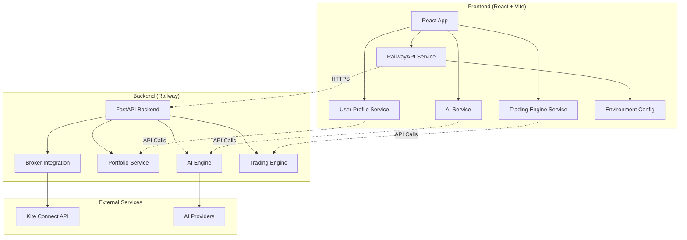
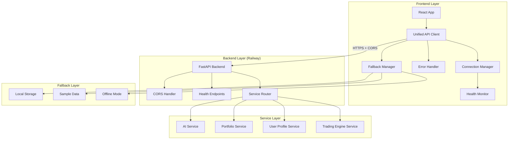
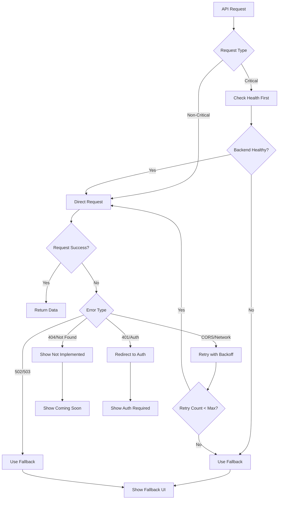

# Design Document

## Overview

This design addresses the critical frontend-backend integration issues in the QuantumLeap trading platform. The system currently experiences connection failures, incorrect API endpoints, WebSocket errors, and missing page routes that prevent proper communication between the React frontend and the Railway-deployed FastAPI backend.

The solution focuses on establishing reliable communication patterns, implementing robust error handling, and ensuring seamless user experience even when backend services are temporarily unavailable.

## Architecture

### Current System Architecture



### Target Architecture



## Components and Interfaces

### 1. Environment Configuration System

**Purpose**: Centralized configuration management for different deployment environments.

**Key Components**:
- `env.js` - Environment variable management
- Railway URL configuration
- Development/production mode detection
- Feature flag management

**Interface**:
```javascript
export const env = {
  API_URL: 'https://web-production-de0bc.up.railway.app',
  NODE_ENV: 'production',
  isDevelopment: () => boolean,
  isProduction: () => boolean,
  get: (key, defaultValue) => string
}
```

### 2. Enhanced RailwayAPI Client

**Purpose**: Robust API client with error handling, retry logic, and fallback mechanisms.

**Key Features**:
- Automatic retry with exponential backoff
- CORS error detection and handling
- Backend health monitoring
- Request deduplication
- Authentication header management

**Interface**:
```javascript
class RailwayAPI {
  async request(endpoint, options): Promise<APIResponse>
  async checkBackendHealth(): Promise<boolean>
  getAuthHeaders(): Object
}
```

### 3. Connection Health Monitor

**Purpose**: Continuous monitoring of backend connectivity and service health.

**Key Components**:
- Health check scheduler
- Service status tracking
- Connection quality metrics
- Automatic reconnection logic

**Interface**:
```javascript
class HealthMonitor {
  async checkHealth(): Promise<HealthStatus>
  startMonitoring(): void
  stopMonitoring(): void
  onStatusChange(callback): void
}
```

### 4. Fallback Management System

**Purpose**: Graceful degradation when backend services are unavailable.

**Key Components**:
- Fallback data providers
- Local storage caching
- Sample data generation
- User notification system

**Interface**:
```javascript
class FallbackManager {
  async getFallbackData(endpoint): Promise<any>
  isInFallbackMode(): boolean
  enableFallbackMode(): void
  disableFallbackMode(): void
}
```

### 5. Route Management System

**Purpose**: Ensure all navigation routes work correctly and handle missing pages.

**Key Components**:
- Route validation
- Dynamic route loading
- 404 error handling
- Navigation state management

**Interface**:
```javascript
const routeConfig = {
  '/trading': TradingEnginePage,
  '/portfolio': PortfolioPage,
  '/ai': AIPage,
  // ... other routes
}
```

### 6. WebSocket Connection Manager

**Purpose**: Handle real-time connections with proper fallback to polling.

**Key Components**:
- WebSocket connection management
- Automatic reconnection
- Polling fallback
- Message queuing

**Interface**:
```javascript
class WebSocketManager {
  connect(url): Promise<WebSocket>
  disconnect(): void
  send(message): void
  onMessage(callback): void
  fallbackToPolling(): void
}
```

## Data Models

### API Response Model
```javascript
interface APIResponse {
  status: 'success' | 'error' | 'cors_error' | 'service_unavailable' | 'not_implemented'
  message?: string
  data?: any
  error?: string
  retry_suggested?: boolean
  fallback_active?: boolean
}
```

### Health Status Model
```javascript
interface HealthStatus {
  backend: 'healthy' | 'unhealthy' | 'unknown'
  services: {
    ai: ServiceStatus
    portfolio: ServiceStatus
    trading: ServiceStatus
    broker: ServiceStatus
  }
  lastCheck: Date
  nextCheck: Date
}

interface ServiceStatus {
  status: 'online' | 'offline' | 'degraded'
  responseTime?: number
  lastError?: string
}
```

### User Session Model
```javascript
interface UserSession {
  userId: string
  isAuthenticated: boolean
  brokerConnected: boolean
  aiConfigured: boolean
  preferences: UserPreferences
  lastActivity: Date
}
```

## Error Handling

### Error Classification System

1. **Network Errors**
   - CORS errors
   - Connection timeouts
   - DNS resolution failures
   - SSL certificate issues

2. **Backend Errors**
   - Service unavailable (502, 503)
   - Authentication failures (401)
   - Not found errors (404)
   - Rate limiting (429)

3. **Application Errors**
   - Invalid data format
   - Business logic violations
   - Configuration errors
   - State inconsistencies

### Error Recovery Strategies



### Fallback Mechanisms

1. **Data Fallbacks**
   - Cached data from localStorage
   - Sample/mock data for demonstration
   - Default values for missing fields

2. **UI Fallbacks**
   - Skeleton loading states
   - Error boundaries with retry options
   - Offline mode indicators

3. **Functional Fallbacks**
   - Read-only mode when write APIs fail
   - Local calculations when server unavailable
   - Manual refresh options

## Testing Strategy

### Unit Testing
- API client methods
- Error handling functions
- Fallback data generation
- Configuration management

### Integration Testing
- Frontend-backend communication
- Authentication flows
- Error recovery scenarios
- Fallback mechanism activation

### End-to-End Testing
- Complete user workflows
- Cross-browser compatibility
- Network failure scenarios
- Performance under load

### Testing Tools
- Jest for unit tests
- React Testing Library for component tests
- Cypress for E2E tests
- Mock Service Worker for API mocking

### Test Scenarios

1. **Happy Path Testing**
   - All services available and responsive
   - User authenticated with all permissions
   - Data loads correctly across all pages

2. **Error Scenario Testing**
   - Backend completely unavailable
   - Intermittent network failures
   - Authentication token expired
   - Individual service failures

3. **Performance Testing**
   - Large dataset handling
   - Concurrent user scenarios
   - Memory leak detection
   - Bundle size optimization

4. **Accessibility Testing**
   - Screen reader compatibility
   - Keyboard navigation
   - Color contrast validation
   - ARIA label verification

## Implementation Phases

### Phase 1: Core Infrastructure
- Environment configuration fixes
- Enhanced RailwayAPI client
- Basic error handling
- Health monitoring setup

### Phase 2: Error Recovery
- Comprehensive error classification
- Retry mechanisms
- Fallback data systems
- User notification improvements

### Phase 3: Route Management
- Route validation and fixes
- Dynamic loading optimization
- 404 handling improvements
- Navigation state management

### Phase 4: Real-time Features
- WebSocket connection management
- Polling fallback implementation
- Message queuing system
- Connection quality monitoring

### Phase 5: User Experience
- Persistent authentication
- Preference management
- Performance optimizations
- Accessibility enhancements

## Security Considerations

### Authentication Security
- Secure token storage
- Automatic token refresh
- Session timeout handling
- Multi-factor authentication support

### API Security
- HTTPS enforcement
- CORS configuration validation
- Request rate limiting
- Input sanitization

### Data Protection
- Sensitive data encryption
- Local storage security
- Memory cleanup
- Audit logging

## Performance Optimizations

### Frontend Optimizations
- Code splitting and lazy loading
- Bundle size reduction
- Caching strategies
- Image optimization

### API Optimizations
- Request deduplication
- Response caching
- Batch operations
- Connection pooling

### User Experience Optimizations
- Progressive loading
- Skeleton screens
- Optimistic updates
- Background sync

## Monitoring and Observability

### Health Monitoring
- Service availability tracking
- Response time monitoring
- Error rate analysis
- User experience metrics

### Performance Monitoring
- Page load times
- API response times
- Memory usage tracking
- Network performance

### Error Tracking
- Error categorization
- Stack trace collection
- User impact analysis
- Recovery success rates

This design provides a comprehensive solution for the frontend-backend integration issues while ensuring scalability, reliability, and excellent user experience.