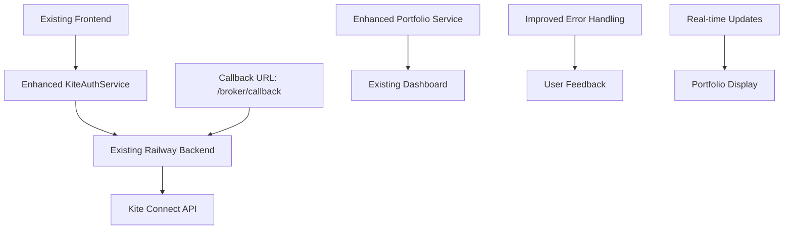

# Kite Connect Portfolio Integration Design

## Overview

This design document outlines the refinements and enhancements to the existing Kite Connect integration with the Quantum Leap Trading Platform. The solution builds upon the current working architecture, focusing on improving the OAuth flow, enhancing portfolio data synchronization, and optimizing user experience while maintaining the existing foundation.

## Architecture

### Current Architecture Analysis

The existing Kite Connect integration already includes:
- ✅ KiteAuthService with OAuth flow handling
- ✅ KiteConnectButton component with credential management
- ✅ Railway backend with callback URL configured
- ✅ Authentication state management
- ✅ Basic portfolio data structures

### Refinement Architecture



### Component Enhancements

1. **Frontend Layer (Existing + Enhancements)**
   - ✅ KiteConnectButton: Enhance UX and error handling
   - ✅ Dashboard: Improve portfolio data display
   - ✅ AuthStatus: Add connection status indicators
   - 🔄 Portfolio Components: Enhance real-time updates

2. **Service Layer (Existing + Enhancements)**
   - ✅ KiteAuthService: Add better error recovery
   - 🔄 Portfolio Service: Enhance data synchronization
   - 🆕 Real-time Service: Add live portfolio updates
   - 🔄 Error Handling: Improve user feedback

3. **Backend Layer (Existing + Enhancements)**
   - ✅ OAuth Callback Handler: Optimize callback processing
   - 🔄 Portfolio API: Enhance data fetching
   - 🔄 Token Management: Improve token lifecycle
   - ✅ Database: Utilize existing user/portfolio tables

## Components and Interfaces

### 1. Enhanced KiteConnectButton Component (Building on Existing)

**Current State:** Already functional with basic OAuth flow
**Enhancements Needed:**
- Improve callback URL handling for `https://web-production-de0bc.up.railway.app/broker/callback`
- Add better loading states and progress feedback
- Enhance error messages and recovery options
- Optimize credential validation flow

**Existing Interface (to maintain):**
```javascript
// Current working interface - keep as is
const KiteConnectButton = ({ onSuccess, onError }) => {
  // Existing implementation with enhancements
}
```

### 2. Portfolio Synchronization Service

**Purpose:** Handle real-time portfolio data synchronization

**Key Features:**
- Automatic data fetching and transformation
- Real-time price updates via WebSocket
- Caching for offline support
- Incremental updates for performance

**Interface:**
```javascript
interface PortfolioService {
  syncPortfolio(): Promise<PortfolioData>;
  subscribeToUpdates(callback: (data) => void): void;
  getHoldings(): Promise<Holding[]>;
  getPositions(): Promise<Position[]>;
  getPerformance(): Promise<Performance>;
}
```

### 3. OAuth Flow Handler

**Purpose:** Process Kite Connect OAuth callbacks securely

**Callback URL:** `https://web-production-de0bc.up.railway.app/broker/callback`

**Flow:**
1. Receive request_token and user_id from Kite
2. Exchange request_token for access_token using API secret
3. Fetch user profile from Kite API
4. Store encrypted credentials in database
5. Generate platform JWT token
6. Redirect to frontend with success/error status

### 4. Real-time Data Updates

**Purpose:** Provide live portfolio value updates during market hours

**Implementation:**
- WebSocket connection to market data provider
- Efficient data diffing and updates
- Automatic reconnection on connection loss
- Rate limiting to prevent API abuse

## Data Models

### 1. Kite User Profile

```javascript
interface KiteUserProfile {
  user_id: string;
  user_name: string;
  email: string;
  access_token: string; // Encrypted
  api_key: string;
  broker: 'zerodha';
  created_at: Date;
  last_sync: Date;
  is_active: boolean;
}
```

### 2. Portfolio Data

```javascript
interface PortfolioData {
  user_id: string;
  holdings: Holding[];
  positions: Position[];
  performance: Performance;
  last_updated: Date;
}

interface Holding {
  instrument_token: string;
  tradingsymbol: string;
  exchange: string;
  quantity: number;
  average_price: number;
  current_price: number;
  pnl: number;
  pnl_percentage: number;
  market_value: number;
}

interface Position {
  instrument_token: string;
  tradingsymbol: string;
  exchange: string;
  product: string;
  quantity: number;
  average_price: number;
  current_price: number;
  pnl: number;
  pnl_percentage: number;
}

interface Performance {
  total_investment: number;
  current_value: number;
  total_pnl: number;
  total_pnl_percentage: number;
  day_pnl: number;
  day_pnl_percentage: number;
}
```

### 3. Authentication State

```javascript
interface AuthState {
  isAuthenticated: boolean;
  user: UserInfo;
  kiteProfile: KiteUserProfile | null;
  connectionStatus: 'connected' | 'disconnected' | 'connecting' | 'error';
  lastError: string | null;
}
```

## Error Handling

### Error Categories

1. **Authentication Errors**
   - Invalid API credentials
   - Expired tokens
   - OAuth flow interruption

2. **API Errors**
   - Kite API rate limits
   - Network connectivity issues
   - Service unavailability

3. **Data Errors**
   - Portfolio sync failures
   - Data transformation errors
   - Cache corruption

### Error Recovery Strategies

1. **Automatic Retry**
   - Exponential backoff for transient errors
   - Circuit breaker pattern for API failures
   - Fallback to cached data when appropriate

2. **User-Initiated Recovery**
   - Clear error messages with actionable steps
   - Manual retry buttons
   - Re-authentication flows

3. **Graceful Degradation**
   - Offline mode with cached data
   - Partial functionality during API issues
   - Alternative data sources when available

## Testing Strategy

### 1. Unit Testing

**Components to Test:**
- KiteAuthService methods
- Portfolio data transformation
- Error handling logic
- Token management

**Test Coverage:**
- Happy path scenarios
- Error conditions
- Edge cases
- Security validations

### 2. Integration Testing

**Test Scenarios:**
- Complete OAuth flow
- Portfolio data synchronization
- Real-time updates
- Error recovery mechanisms

**Test Environment:**
- Kite Connect sandbox API
- Mock data for consistent testing
- Automated test suite

### 3. End-to-End Testing

**User Journeys:**
- First-time Kite Connect setup
- Portfolio viewing and navigation
- Error scenarios and recovery
- Token refresh and re-authentication

**Testing Tools:**
- TestSprite for comprehensive testing
- Playwright for browser automation
- Custom test utilities for Kite API mocking

### 4. Security Testing

**Security Validations:**
- Credential encryption verification
- Token storage security
- API communication security
- Data privacy compliance

## Performance Considerations

### 1. Data Caching

- Redis cache for portfolio data
- Browser localStorage for user preferences
- Service worker for offline support
- Intelligent cache invalidation

### 2. API Optimization

- Batch API requests where possible
- Implement request deduplication
- Use WebSocket for real-time updates
- Optimize data transformation pipelines

### 3. Frontend Performance

- Lazy loading of portfolio components
- Virtual scrolling for large holdings lists
- Optimized re-rendering with React.memo
- Progressive loading of portfolio sections

## Security Implementation

### 1. Credential Protection

- AES-256 encryption for stored tokens
- Secure key management with environment variables
- Regular token rotation
- Audit logging for credential access

### 2. API Security

- HTTPS enforcement for all communications
- Request signing for sensitive operations
- Rate limiting and abuse prevention
- Input validation and sanitization

### 3. Data Privacy

- Minimal data collection principle
- User consent for data processing
- Secure data transmission
- Compliance with financial data regulations

## Deployment Strategy

### 1. Backend Deployment

- Railway platform deployment
- Environment-specific configurations
- Database migration scripts
- Health check endpoints

### 2. Frontend Deployment

- Vercel/Netlify deployment
- Environment variable management
- CDN optimization
- Progressive web app features

### 3. Monitoring and Observability

- Application performance monitoring
- Error tracking and alerting
- User analytics and behavior tracking
- API usage monitoring

## Migration and Rollback Plan

### 1. Gradual Rollout

- Feature flags for controlled release
- A/B testing for user experience validation
- Gradual user migration from old system
- Performance monitoring during rollout

### 2. Rollback Strategy

- Database backup and restore procedures
- Feature flag-based instant rollback
- User communication plan
- Data integrity verification

This design provides a comprehensive approach to refining the Kite Connect integration while ensuring security, performance, and excellent user experience.