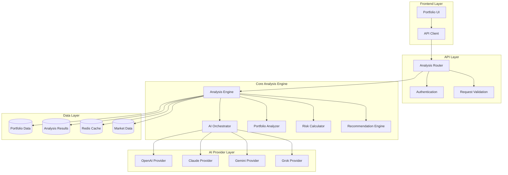

# Portfolio AI Analysis Backend - Design Document

## Overview

This design document outlines the architecture and implementation approach for a full-scale portfolio AI analysis backend system. The system will provide comprehensive portfolio analysis, risk assessment, and optimization recommendations using multiple AI providers with intelligent selection and fallback mechanisms.

## Architecture

### High-Level Architecture



### Component Architecture

#### 1. Enhanced Analysis Router
- **Purpose**: Handle API requests and route to appropriate analysis components
- **Key Features**:
  - Request validation and sanitization
  - User authentication and authorization
  - Rate limiting and throttling
  - Response formatting and error handling
  - API versioning support

#### 2. Portfolio Analysis Engine
- **Purpose**: Core engine for portfolio analysis and coordination
- **Key Features**:
  - Portfolio data processing and validation
  - Analysis orchestration and workflow management
  - Result aggregation and formatting
  - Caching and performance optimization
  - Error handling and recovery

#### 3. AI Orchestrator Enhancement
- **Purpose**: Intelligent AI provider selection and management
- **Key Features**:
  - Provider health monitoring and selection
  - Load balancing and failover
  - Cost optimization and usage tracking
  - Provider-specific prompt optimization
  - Response quality assessment

#### 4. Portfolio Analyzer
- **Purpose**: Specialized portfolio analysis calculations
- **Key Features**:
  - Diversification metrics calculation
  - Sector allocation analysis
  - Performance benchmarking
  - Correlation analysis
  - Liquidity assessment

#### 5. Risk Calculator
- **Purpose**: Comprehensive risk assessment and scoring
- **Key Features**:
  - Concentration risk calculation
  - Volatility assessment
  - Market risk integration
  - Risk scoring and categorization
  - Stress testing capabilities

#### 6. Recommendation Engine
- **Purpose**: Generate actionable portfolio recommendations
- **Key Features**:
  - Rule-based recommendation generation
  - AI-powered recommendation synthesis
  - Recommendation prioritization and scoring
  - Implementation step generation
  - Confidence scoring

## Components and Interfaces

### 1. Enhanced Analysis Router Interface

```python
class EnhancedAnalysisRouter:
    async def analyze_portfolio(
        self, 
        portfolio_data: Dict[str, Any],
        user_id: str,
        analysis_options: Optional[AnalysisOptions] = None
    ) -> PortfolioAnalysisResponse
    
    async def get_analysis_history(
        self,
        user_id: str,
        limit: int = 10,
        offset: int = 0
    ) -> AnalysisHistoryResponse
    
    async def get_analysis_status(
        self,
        analysis_id: str,
        user_id: str
    ) -> AnalysisStatusResponse
```

### 2. Portfolio Analysis Engine Interface

```python
class PortfolioAnalysisEngine:
    async def analyze_portfolio(
        self,
        user_id: str,
        portfolio_data: Dict[str, Any],
        market_context: Optional[Dict[str, Any]] = None
    ) -> PortfolioAnalysisResult
    
    async def calculate_portfolio_health(
        self,
        portfolio_data: Dict[str, Any]
    ) -> PortfolioHealthScore
    
    async def generate_recommendations(
        self,
        user_id: str,
        portfolio_data: Dict[str, Any],
        analysis_results: Dict[str, Any]
    ) -> List[PortfolioRecommendation]
```

### 3. AI Provider Integration Interface

```python
class AIProviderIntegration:
    async def generate_portfolio_analysis(
        self,
        prompt: str,
        portfolio_data: Dict[str, Any],
        provider_preferences: Optional[Dict[str, Any]] = None
    ) -> AIAnalysisResponse
    
    async def validate_analysis_quality(
        self,
        analysis_result: str,
        expected_format: str
    ) -> ValidationResult
```

## Data Models

### 1. Portfolio Analysis Request Model

```python
class PortfolioAnalysisRequest(BaseModel):
    portfolio_data: Dict[str, Any]
    analysis_options: Optional[AnalysisOptions] = None
    include_recommendations: bool = True
    include_risk_analysis: bool = True
    include_optimization: bool = True
    market_context: Optional[Dict[str, Any]] = None
```

### 2. Portfolio Analysis Response Model

```python
class PortfolioAnalysisResponse(BaseModel):
    status: str
    analysis_id: str
    portfolio_health: PortfolioHealthScore
    risk_analysis: RiskAnalysisResult
    diversification_analysis: DiversificationResult
    recommendations: List[PortfolioRecommendation]
    key_insights: List[str]
    performance_metrics: PerformanceMetrics
    provider_used: str
    confidence_score: float
    generated_at: datetime
    processing_time_ms: int
```

### 3. Portfolio Health Score Model

```python
class PortfolioHealthScore(BaseModel):
    overall_score: float  # 0-100
    performance_score: float
    diversification_score: float
    risk_score: float
    liquidity_score: float
    factors: Dict[str, float]
    grade: str  # A, B, C, D, F
    improvement_areas: List[str]
```

### 4. Risk Analysis Result Model

```python
class RiskAnalysisResult(BaseModel):
    overall_risk_level: str  # low, medium, high
    concentration_risk: float
    sector_risk: Dict[str, float]
    volatility_metrics: VolatilityMetrics
    var_analysis: VaRAnalysis
    stress_test_results: Optional[Dict[str, Any]]
    risk_factors: List[RiskFactor]
```

### 5. Portfolio Recommendation Model

```python
class PortfolioRecommendation(BaseModel):
    recommendation_id: str
    type: RecommendationType  # rebalance, diversify, optimize, risk_management
    priority: Priority  # high, medium, low
    title: str
    description: str
    rationale: str
    implementation_steps: List[str]
    expected_impact: str
    confidence_score: float
    risk_impact: Optional[str]
    cost_estimate: Optional[float]
    timeframe: Optional[str]
```

## Error Handling

### Error Categories

1. **Validation Errors**
   - Invalid portfolio data format
   - Missing required fields
   - Data type mismatches

2. **Processing Errors**
   - Analysis calculation failures
   - AI provider errors
   - Database connection issues

3. **Business Logic Errors**
   - Insufficient portfolio data
   - Unsupported analysis types
   - Configuration errors

4. **System Errors**
   - Service unavailability
   - Timeout errors
   - Resource exhaustion

### Error Response Format

```python
class ErrorResponse(BaseModel):
    status: str = "error"
    error_code: str
    message: str
    details: Optional[Dict[str, Any]] = None
    retry_after: Optional[int] = None
    support_reference: Optional[str] = None
```

### Error Handling Strategy

1. **Graceful Degradation**: Provide partial results when possible
2. **Automatic Retry**: Implement exponential backoff for transient errors
3. **Fallback Mechanisms**: Use alternative providers or simplified analysis
4. **User-Friendly Messages**: Convert technical errors to actionable user messages
5. **Logging and Monitoring**: Comprehensive error tracking and alerting

## Testing Strategy

### 1. Unit Testing
- **Portfolio Analyzer Tests**: Test calculation accuracy and edge cases
- **Risk Calculator Tests**: Validate risk metrics and scoring algorithms
- **Recommendation Engine Tests**: Test recommendation generation and prioritization
- **AI Provider Tests**: Mock provider responses and test integration

### 2. Integration Testing
- **End-to-End Analysis Flow**: Test complete portfolio analysis workflow
- **Provider Failover Testing**: Test AI provider selection and fallback
- **Database Integration**: Test data persistence and retrieval
- **API Endpoint Testing**: Test all API endpoints with various scenarios

### 3. Performance Testing
- **Load Testing**: Test system performance under concurrent requests
- **Stress Testing**: Test system behavior at capacity limits
- **Response Time Testing**: Ensure analysis completes within acceptable timeframes
- **Memory Usage Testing**: Monitor memory consumption during analysis

### 4. AI Quality Testing
- **Analysis Accuracy**: Compare AI results with expected outcomes
- **Consistency Testing**: Test result consistency across multiple runs
- **Provider Comparison**: Compare results across different AI providers
- **Prompt Optimization**: Test different prompt strategies for optimal results

## Implementation Phases

### Phase 1: Core Infrastructure
1. Enhanced analysis router implementation
2. Portfolio data validation and processing
3. Basic portfolio metrics calculation
4. Database schema updates and migrations

### Phase 2: Analysis Engine
1. Portfolio analyzer implementation
2. Risk calculator development
3. Diversification metrics calculation
4. Performance benchmarking integration

### Phase 3: AI Integration
1. AI orchestrator enhancements
2. Provider-specific prompt optimization
3. Response parsing and validation
4. Quality assessment implementation

### Phase 4: Recommendation System
1. Rule-based recommendation engine
2. AI-powered recommendation synthesis
3. Recommendation prioritization and scoring
4. Implementation guidance generation

### Phase 5: Optimization and Monitoring
1. Caching implementation
2. Performance optimization
3. Monitoring and alerting setup
4. Documentation and testing completion

## Security Considerations

### 1. Data Protection
- Encrypt sensitive portfolio data at rest and in transit
- Implement proper access controls and authorization
- Audit trail for all analysis requests and results
- Data retention and deletion policies

### 2. API Security
- Rate limiting and DDoS protection
- Input validation and sanitization
- Authentication token management
- CORS and security headers

### 3. AI Provider Security
- Secure API key storage and rotation
- Provider response validation
- Data minimization for AI requests
- Audit logging for AI interactions

## Performance Optimization

### 1. Caching Strategy
- Redis caching for frequently accessed data
- Analysis result caching with TTL
- Provider response caching
- Database query result caching

### 2. Database Optimization
- Proper indexing for analysis queries
- Connection pooling and management
- Query optimization and monitoring
- Data archiving strategies

### 3. Concurrent Processing
- Async/await for I/O operations
- Parallel processing for independent calculations
- Queue management for analysis requests
- Resource pooling and management

### 4. Monitoring and Alerting
- Response time monitoring
- Error rate tracking
- Resource utilization monitoring
- AI provider performance tracking