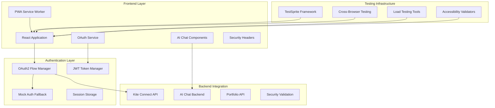

# TestSprite Remaining Issues Resolution Design

## Overview

This design document outlines the technical architecture and implementation approach for resolving the remaining 7 TestSprite test failures. The solution focuses on completing OAuth2 integration, fixing AI Chat accessibility, implementing PWA functionality, ensuring accessibility compliance, validating security measures, achieving cross-browser compatibility, and enabling load testing capabilities.

## Architecture

### High-Level System Architecture



## Components and Interfaces

### 1. Enhanced OAuth2 Integration System

#### OAuth2FlowManager Class
```javascript
class OAuth2FlowManager {
  constructor() {
    this.kiteApiKey = process.env.VITE_KITE_API_KEY;
    this.kiteApiSecret = process.env.VITE_KITE_API_SECRET;
    this.callbackUrl = 'https://web-production-de0bc.up.railway.app/broker/callback';
    this.useMockFallback = !this.kiteApiKey || process.env.VITE_ENABLE_MOCK_OAUTH === 'true';
  }
  
  async initiateOAuth();
  async handleCallback(requestToken);
  async exchangeTokens(requestToken);
  async validateSession();
  async refreshTokens();
}
```

#### Mock OAuth Simulator
```javascript
class MockOAuthSimulator {
  async simulateOAuthFlow();
  async generateMockTokens();
  async simulateKiteCallback();
  async mockPortfolioData();
}
```

### 2. AI Chat Accessibility Enhancement

#### ChatPageRouter Component
```javascript
const ChatPageRouter = () => {
  // Ensures proper routing and component loading
  // Handles authentication state integration
  // Provides error boundaries and fallback states
};
```

#### Enhanced AI Chat Service
```javascript
class AIChatsService {
  async initializeChatSession();
  async sendMessage(message, context);
  async handleConnectionErrors();
  async validateChatAccess();
}
```### 3. P
rogressive Web App (PWA) Implementation

#### Service Worker Architecture
```javascript
// sw.js - Service Worker Implementation
class QuantumLeapServiceWorker {
  constructor() {
    this.CACHE_NAME = 'quantum-leap-v1';
    this.OFFLINE_CACHE = 'quantum-leap-offline';
    this.API_CACHE = 'quantum-leap-api';
  }
  
  async handleInstall();
  async handleActivate();
  async handleFetch(event);
  async cachePortfolioData();
  async syncOfflineActions();
}
```

#### PWA Manifest Configuration
```json
{
  "name": "Quantum Leap Trading Platform",
  "short_name": "QuantumLeap",
  "description": "AI-Powered Trading Platform",
  "start_url": "/",
  "display": "standalone",
  "background_color": "#1e293b",
  "theme_color": "#3b82f6",
  "icons": [
    {
      "src": "/icons/icon-192x192.png",
      "sizes": "192x192",
      "type": "image/png"
    },
    {
      "src": "/icons/icon-512x512.png",
      "sizes": "512x512",
      "type": "image/png"
    }
  ]
}
```

### 4. Accessibility Compliance System

#### AccessibilityManager Class
```javascript
class AccessibilityManager {
  constructor() {
    this.wcagLevel = 'AA';
    this.validators = [];
  }
  
  async validateKeyboardNavigation();
  async checkColorContrast();
  async validateAriaLabels();
  async testScreenReaderCompatibility();
  async generateAccessibilityReport();
}
```

#### Accessibility Enhancement Components
```javascript
const AccessibleButton = ({ children, ariaLabel, ...props }) => {
  // Enhanced button with proper ARIA attributes
};

const AccessibleForm = ({ children, ...props }) => {
  // Form with proper labeling and error handling
};

const SkipNavigation = () => {
  // Skip navigation links for keyboard users
};
```

### 5. Security Validation Framework

#### SecurityValidator Class
```javascript
class SecurityValidator {
  constructor() {
    this.securityHeaders = [
      'Content-Security-Policy',
      'X-Frame-Options',
      'X-Content-Type-Options',
      'Strict-Transport-Security'
    ];
  }
  
  async validateJWTTokens();
  async checkSecurityHeaders();
  async validateCSRFProtection();
  async testSessionSecurity();
  async encryptCredentials();
}
```

#### JWT Token Enhancement
```javascript
class EnhancedJWTManager {
  constructor() {
    this.algorithm = 'HS256';
    this.expirationTime = '24h';
    this.refreshThreshold = 300; // 5 minutes
  }
  
  async generateToken(payload);
  async validateToken(token);
  async refreshToken(token);
  async revokeToken(token);
  async checkTokenExpiry(token);
}
```

### 6. Cross-Browser Compatibility Layer

#### BrowserCompatibilityManager
```javascript
class BrowserCompatibilityManager {
  constructor() {
    this.supportedBrowsers = ['chrome', 'firefox', 'safari', 'edge'];
    this.polyfills = [];
  }
  
  async detectBrowser();
  async loadPolyfills();
  async validateFeatureSupport();
  async handleBrowserSpecificIssues();
}
```

#### Browser-Specific Adaptations
```javascript
const BrowserAdapter = {
  chrome: {
    optimizations: ['webgl', 'webworkers'],
    fallbacks: []
  },
  firefox: {
    optimizations: ['indexeddb'],
    fallbacks: ['localStorage']
  },
  safari: {
    optimizations: ['webkit-transforms'],
    fallbacks: ['css-fallbacks']
  },
  edge: {
    optimizations: ['edge-specific'],
    fallbacks: ['ie-compatibility']
  }
};
```

### 7. Load Testing Infrastructure

#### LoadTestingManager
```javascript
class LoadTestingManager {
  constructor() {
    this.maxConcurrentUsers = 100;
    this.testDuration = 300; // 5 minutes
    this.rampUpTime = 60; // 1 minute
  }
  
  async simulateConcurrentUsers();
  async monitorPerformanceMetrics();
  async validateResponseTimes();
  async testResourceUtilization();
  async generateLoadTestReport();
}
```

## Data Models

### OAuth Token Model
```javascript
interface OAuthToken {
  accessToken: string;
  refreshToken: string;
  expiresAt: Date;
  tokenType: 'Bearer';
  scope: string[];
  userId: string;
  provider: 'kite' | 'mock';
}
```

### Chat Session Model
```javascript
interface ChatSession {
  sessionId: string;
  userId: string;
  threadId: string;
  messages: ChatMessage[];
  context: ChatContext;
  isActive: boolean;
  createdAt: Date;
  lastActivity: Date;
}
```

### PWA Cache Model
```javascript
interface PWACacheEntry {
  url: string;
  data: any;
  timestamp: Date;
  expiresAt: Date;
  priority: 'high' | 'medium' | 'low';
  syncStatus: 'synced' | 'pending' | 'failed';
}
```

### Security Audit Model
```javascript
interface SecurityAudit {
  auditId: string;
  timestamp: Date;
  checks: SecurityCheck[];
  overallScore: number;
  vulnerabilities: Vulnerability[];
  recommendations: string[];
}
```

## Error Handling

### Centralized Error Management
```javascript
class ErrorManager {
  constructor() {
    this.errorTypes = {
      OAUTH_ERROR: 'OAuth authentication failed',
      CHAT_ERROR: 'AI Chat service unavailable',
      PWA_ERROR: 'PWA functionality not supported',
      SECURITY_ERROR: 'Security validation failed',
      BROWSER_ERROR: 'Browser compatibility issue',
      LOAD_ERROR: 'System under excessive load'
    };
  }
  
  async handleError(error, context);
  async logError(error, metadata);
  async notifyUser(error, recovery);
  async attemptRecovery(error);
}
```

### Error Recovery Strategies
```javascript
const ErrorRecoveryStrategies = {
  OAUTH_FALLBACK: () => mockAuthService.login(),
  CHAT_RETRY: () => retryWithBackoff(),
  PWA_GRACEFUL_DEGRADATION: () => disablePWAFeatures(),
  SECURITY_SAFE_MODE: () => enableSafeMode(),
  BROWSER_POLYFILL: () => loadCompatibilityLayer(),
  LOAD_THROTTLE: () => enableRateLimiting()
};
```

## Testing Strategy

### TestSprite Integration Testing
```javascript
class TestSpriteIntegration {
  constructor() {
    this.testCredentials = {
      email: 'test@quantumleap.com',
      password: 'testpassword123'
    };
    this.testScenarios = [
      'oauth_flow_complete',
      'chat_accessibility',
      'pwa_functionality',
      'accessibility_compliance',
      'security_validation',
      'cross_browser_compatibility',
      'load_testing'
    ];
  }
  
  async setupTestEnvironment();
  async executeTestScenario(scenario);
  async validateTestResults();
  async generateTestReport();
}
```

### Automated Testing Framework
```javascript
const TestingFramework = {
  unit: {
    framework: 'Jest',
    coverage: '90%',
    files: ['*.test.js', '*.spec.js']
  },
  integration: {
    framework: 'Cypress',
    scenarios: ['user-flows', 'api-integration'],
    browsers: ['chrome', 'firefox', 'edge']
  },
  e2e: {
    framework: 'TestSprite',
    scenarios: ['complete-user-journey'],
    validation: 'all-15-tests-passing'
  }
};
```

## Performance Optimization

### Caching Strategy
```javascript
const CachingStrategy = {
  static: {
    assets: ['js', 'css', 'images'],
    duration: '1 year',
    strategy: 'cache-first'
  },
  dynamic: {
    api: ['portfolio', 'market-data'],
    duration: '5 minutes',
    strategy: 'network-first'
  },
  offline: {
    essential: ['dashboard', 'portfolio'],
    duration: '24 hours',
    strategy: 'cache-only'
  }
};
```

### Load Balancing and Scaling
```javascript
const ScalingStrategy = {
  frontend: {
    cdn: 'CloudFlare',
    compression: 'gzip',
    minification: true
  },
  backend: {
    loadBalancer: 'Railway',
    autoScaling: true,
    healthChecks: true
  },
  database: {
    connectionPooling: true,
    queryOptimization: true,
    indexing: 'optimized'
  }
};
```

## Security Implementation

### Authentication Security
```javascript
const SecurityMeasures = {
  authentication: {
    tokenEncryption: 'AES-256',
    sessionTimeout: '24 hours',
    refreshTokenRotation: true,
    bruteForceProtection: true
  },
  communication: {
    https: 'enforced',
    certificatePinning: true,
    corsPolicy: 'strict',
    csrfProtection: true
  },
  storage: {
    sensitiveDataEncryption: true,
    secureStorage: 'localStorage with encryption',
    dataRetention: '30 days',
    gdprCompliance: true
  }
};
```

### Security Headers Configuration
```javascript
const SecurityHeaders = {
  'Content-Security-Policy': "default-src 'self'; script-src 'self' 'unsafe-inline'; style-src 'self' 'unsafe-inline'",
  'X-Frame-Options': 'DENY',
  'X-Content-Type-Options': 'nosniff',
  'Strict-Transport-Security': 'max-age=31536000; includeSubDomains',
  'Referrer-Policy': 'strict-origin-when-cross-origin',
  'Permissions-Policy': 'geolocation=(), microphone=(), camera=()'
};
```

## Deployment Strategy

### Environment Configuration
```javascript
const EnvironmentConfig = {
  development: {
    mockAuth: true,
    debugMode: true,
    testCredentials: 'enabled',
    pwaMode: 'development'
  },
  testing: {
    mockAuth: 'conditional',
    testSprite: true,
    allBrowsers: true,
    loadTesting: true
  },
  production: {
    mockAuth: false,
    realOAuth: true,
    pwaEnabled: true,
    securityMaximum: true
  }
};
```

### Rollback Strategy
```javascript
const RollbackPlan = {
  triggers: [
    'testSprite failure rate > 20%',
    'authentication failure rate > 5%',
    'critical security vulnerability',
    'performance degradation > 50%'
  ],
  actions: [
    'immediate rollback to previous version',
    'enable mock authentication fallback',
    'disable PWA features if problematic',
    'activate safe mode for all users'
  ],
  recovery: [
    'fix identified issues',
    'run full test suite',
    'gradual re-deployment',
    'monitor metrics closely'
  ]
};
```

## Monitoring and Observability

### Metrics Collection
```javascript
const MonitoringMetrics = {
  authentication: {
    successRate: 'oauth_success_rate',
    failureReasons: 'oauth_failure_types',
    responseTime: 'oauth_response_time'
  },
  chat: {
    accessibility: 'chat_page_load_success',
    functionality: 'chat_message_success_rate',
    errorRate: 'chat_error_rate'
  },
  pwa: {
    installRate: 'pwa_install_rate',
    offlineUsage: 'offline_feature_usage',
    syncSuccess: 'offline_sync_success'
  },
  performance: {
    loadTime: 'page_load_time',
    concurrentUsers: 'active_user_count',
    resourceUsage: 'system_resource_usage'
  }
};
```

### Alerting System
```javascript
const AlertingRules = {
  critical: {
    'testSprite failure rate > 10%': 'immediate',
    'authentication failure rate > 3%': 'immediate',
    'security vulnerability detected': 'immediate'
  },
  warning: {
    'chat accessibility issues': '5 minutes',
    'PWA functionality degraded': '10 minutes',
    'cross-browser compatibility issues': '15 minutes'
  },
  info: {
    'load testing completed': 'daily',
    'accessibility audit completed': 'weekly',
    'security scan completed': 'weekly'
  }
};
```

This design provides a comprehensive technical foundation for resolving all remaining TestSprite issues while maintaining system reliability and user experience.